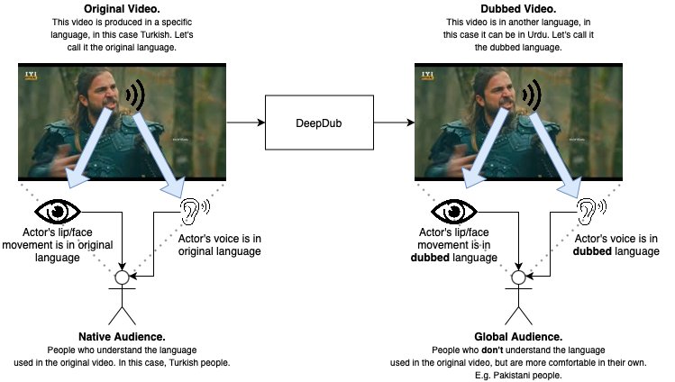

# deepdub
🗣️ Making videos more accessible to people around the world.

## Welcome
This is the main repo of deepdub. It contains a CLI engine and a [Wooey](https://github.com/wooey/wooey) engine which adds a UI to the CLI. 

## Installation Guide
The CLI and the web server have separate installation mechanisms, however in our tests we find that if you install the CLI first and the web server afterwards, everything comes together pretty nicely.

[Click here](INSTALL.md) for the **main** installation guide.

---

## What is Deepdub?
Over 2.3 billion people worldwide use YouTube once a month. Yet, it is estimated that only 25% of the world’s population has an estimation of what the English language is. Thus, it can be inferred that many people would be having difficulty understanding videos which are in English. This brings a need for video translation into other languages.

This is normally tackled by manual dubbing, in which a translated script is written, voice actors are hired, and video editors mix together tracks to create a dubbed version of the original video. Yet even after all this labor, in the end-product we see that the lip movement of the actor in the original video, does not match with the dubbed audio. Here we see another gap; automatic voice dubbing, and also lip syncing of dubbed audio with the original clip.

To solve these problems, we aim to build a pipeline called "Deepdub" which takes input a video, and outputs a dubbed version of it in a preferred language, with the lips synced to the dubbed audio.



## Iterations

### Pipeline 0 (Release 1)
We started off simple, and tried our best to make a pipeline which at least WORKS.

During our research, we came across text-to-speech implementations, and speech-to-lip (speech-driven facial generation) implementations. So we got a cool idea for our first pipeline... why not put those two together!

```
🖊🍍🍎🖊
\(•_•)/
( ( pen-pineapple-apple-pen
/ \
```

We had a rough idea in our head about what we were aiming for:


Out of the implementations we saw, we identified some of the best to be:
- TTS -> [Real-Time-Voice-Cloning](https://github.com/CorentinJ/Real-Time-Voice-Cloning)
- STL -> [Wav2Lip](https://github.com/Rudrabha/Wav2Lip)

So we visualized a pipeline as the following:


More on the implementation-level details, ToDos, etc are [here](./deepdub_cli/README.md).

### Sample Results

Original Video:
https://drive.google.com/file/d/1bedh5iu2L8y_zG8XWu2x6wFZG4yykIyv/view?usp=sharing

Translated Video (using Deepdub):
https://drive.google.com/file/d/1pDv6-JCHaTafGNarOuMuhGIcv6x-PPM5/view?usp=sharing