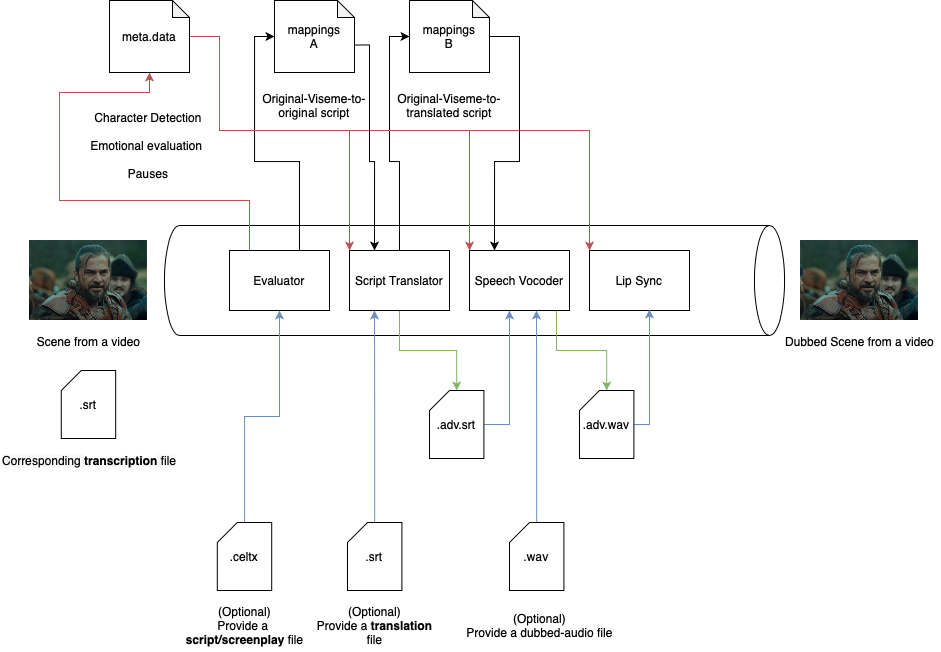

# Deepdub - Pipeline 0
The first-ever Deepdub pipeline executing purely Text-to-Lip generation (TTL).

## Current code structure
The driver files of this pipeline are ```main.py``` and ```main2.py```. Why are there two, you ask? Well, it's because of weird Python packaging rules which I try very hard to get my head around, but fail every time.

Basically my original design was to keep the "modules" (in our case, **Real-Time-Voice-Cloning** and **Wav2Lip**) in the src folder, in their own respective folders. In each "module", I had created a function called ```run_cli```. Then in the main function, I would simply call the ```run_cli``` function to do the functionality. It was clean and honest work.

But when connecting the CLI to Wooey, it gave strange errors like ```src/blah_blah... src is not a package```. 

So in pure rage, I copied the contents of each module into the same directory as the ```main.py``` driving file. It's super messy, but at least it gets the job done.

So keeping that all in mind, try using ```main2.py``` where possible because it's likely that it's the most recent version.

## Future work
_17/11/21:_ We are currently putting this pipeline aside, as is, so we can work on a complete new implementation. If it does **not** work well, we shall return here.

_16/11/21:_ There are quite some things we need to improve to fix errors and perhaps streamline the process.
- Clean up code, try making into packages
- Train all models on relevant (high-res) data
- Handle error cases instead of crashing the entire pipeline on errors
- Allow user to introduce extracted/translated files by their own choice

_15/11/21:_ Pipeline proposed improvements
